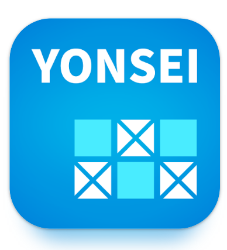

目录
## 1. 各证明及文件发放方法
## 2. 相关应用程序的使用方法 
## 3. 国际校园及宿舍楼
## 4. 国际校园周边设施介绍
## 5. 国际校区公共交通及班车预约方法
## 6. GLC 各学生会Ins介绍

## 1.各证明及文件发放方法
  
### 外国人登录证签发方法
**准备材料**：
1. 在校证明书
    可在연세포탈证明书签发中获取。

2. 居住证明书
    进入연세포탈 학사 정보시스템 기숙사-＞입사확인서用韩文发放

3. 护照（打印后提交）
4. 签证
5. 彩色证件照 3.5cmx4.5cm
6. 申请书（集体申请外国人登录证时不需要）

**申请方法：**
  团体申请的情况：
  准备好所需材料并交纳手续费后申请
  之后学校会发来通知
   
  个人申请时：
在HiKorea预约访问后，带申请材料去申请
预约可能会马上结束，入境后要马上预约。
必须去仁川外国人出入境事务所。

### 银行开户及手机开通方法
-访问银行后,按顺序取一张等候票，按照号码等待叫号。
_开户时,按照职员的指示填写申请书并提交材料即可。
-根据职员的介绍，输入密码，并拿走发放的存折和银行卡。

**开银行账户需要提交的材料：**
-在校证明书
_居住证
-护照及外国人登录证

### 手机号码开通方法：
步骤：
- 向通信公司分支机构或代理机构提交外国人登录证复印件或护照复印件。 代理机构提出申请的，还应当提供代理机构身份证件。
- 通过通信公司代理店或在线接收手机号码。
- 对比多种手机套餐类型，选择适合自己需要的套餐即可。

**开通时所需材料：**
身份证（护照，外国人登陆证等）
韩国银行账户

## 2. 相关应用程序的使用方法 

### Yammi

学生食堂支付APP: 需要银行卡等网上支付手段
Yammi应用程序在新村校区和松岛校区两个校园都可以使用, 是在学生食堂进行选餐，在线结算的应用程序。 在韩国的各大学进行的"1000韩元的早餐"也可以在Yammi获得学生认证后购买。 除此之外，相关餐食的照片、评论、留言等都可以查询到。 另外,还可以通过Yammi应用程序在学校咖啡厅进行网上订购。 支付功能需要银行卡才能实现,因此银行卡或网上支付手段是必须的。
Yammi应用程序使用方法（购买宿舍食堂、食堂、饮料）: 
下载Yammi应用程序→选择学校（延世大学（国际））
→点击Yammi开始按钮
→登录/加入会员（必须要有韩国电话号码）
→选择餐厅（1宿舍，2宿舍，咖啡厅（Tresbien，Coffee&）
→选择菜单后按下装购物车的按钮
→用要结算的卡
→结算
→用二维码码取餐。 
- 在Yammi应用**软件中不能用现金**结账，没有账户或想用现金购买时，可以在各餐厅/咖啡厅的收银台进行结账。

### Everytime

大学生自己的社区:  需要学校账户（学号）
通过Yonsei portal的账户进行注册,并在里面标明了各种公告栏。 其软件可以查询各种信息。
还有一个核心功能是课程查询。
在时间表内添加自己喜欢的课程,并自动成为可视化课程表。 学期结束后,自己输入该课程成绩,自动换算成4.3标准的成绩。 添加朋友申请并得到批准后,还可以看到朋友的课程时间表。
点击具体的课程,还可以查询对课程的评价。 评价都是以前上过这门课的学生写的。

### mY-seat2

图书馆使用应用程序-学校账户（学号）必须
"mY-seat2"主要由图书馆座位预约及图书馆设施使用预约两种功能构成。 用学校账号登录后选择使用图书馆,就会出现可以使用的座位。 分配到自己喜欢的座位后,可以有4小时的座位使用权。 预约图书馆设施时,根据设施使用最少人数,输入用户的学号、电话号码后4位即可预约成功。

### Y-Attend

延世大学电子出勤系统
在学校上课前总要确认上课出席。 这时也有通过电子出勤进行认证的课程。 该课程的教授告诉学生4位数字,学生进入该应用程序登录后自动显示"请输入数字"的画面。 在相应时间内输入成功，即可完成上课出席认证。

## 3. 国际校区和宿舍设施介绍

### 安德伍德纪念图书馆

通常被简称为"언기도"。闭馆时间是午夜,有2个出入口,
正门下楼梯连接地下1层Y-广场,后面另一个连接1层外后侧。

-地下1楼-社区休息室:在名为"Creative Talks"的地方,屏幕上播放着TED讲座。 在"艺术画廊"中,各个屏幕都展示着各种颜色的照片。
 
### Y-Plaza

与图书馆地下1层相连的商业街设施。 小卖部、文具店、书店、食堂、理发店、打印店还有眼镜店、咖啡厅等多种设施。 

-1楼-信息商务:可以在用户综合服务台获得预约图书、校园借阅图书、相互借阅、附带资料等。
-2楼 - 多媒体中心:媒体欣赏室 设有阅览席,可以阅览电影、电视剧、纪录片等DVD。 电影数量也很多。单人房、双人房都有，3人以上可以租9人室、6人室大小的电影房，通过屏幕观看DVD。
-3楼-合作公园:集体学习室、PC Express区域坐落于此。
-4楼 - 创意阅览室:备有讲座、新书、RC推荐图书。有9个名为"pangse"的鸡蛋模样的四色沙发。 坐在上面，不仅可以阅读4楼摆放的各种杂志，还可以看到大海。
-5楼 - 资料阅览室:000-699号图书坐落于此。
-6楼 - 资料阅览室:700-999号图书坐落于此。
-7楼 - 国际会议室:设有会议室、无人休息室、露台休息室。
 
### 宿舍设施

#### 快递保管室，无人快递箱，微笑箱
1学社A栋1楼
2学社D栋1楼

### 邮箱
在每栋楼里。
只有F栋、G栋在D栋1楼内。
 
### 阅览室
1学社A栋1楼
2学社D栋2楼（位于1楼休息室上面。）

阅览室使用方法

### 研讨室
1 学社A 和 B 栋 7 层（过桥），
C 栋 1 层，5 层
2学社D栋3楼
研讨室预约方法:
延世学校网站登录后→学士信息系统→宿舍>预约会议室→生活馆（松岛1宿舍、2宿舍中选择）→选择预约日期，选择会议室，在可预约时间中选择预约时间→输入活动信息→申请
 
#### 洗衣室
1学社A栋C栋B1楼
2学社G栋5楼（女性），F栋5楼（男性）
 
洗衣服的方法
1宿舍
购买洗衣卡
可以充值并使用

2宿舍
下载meta club应用程序
付款等都是用这个软件做的。
*外国人登录证、手机认证是必须的

#### 便利店 
1学社B1楼
2学社D栋1楼
 
#### 宿舍食堂
1学社 地下1楼
2学社 D栋1楼
 
#### 咖啡馆
1学社地下1层
2学社D栋1楼（宿舍食堂内）
 
#### 公共厨房
1学社地下1楼（宿舍食堂旁边）
2学社 F 栋 5 楼（从电梯 4 层下后走上紧急楼梯）
 
#### 电脑室/多媒体室（印刷机，黑白可打印）
1学社A栋1楼
2学社D栋3楼
 
#### 乒乓球台球厅
社区室（公共冰箱、垃圾回收、微波炉）
1宿舍地下1层
位于2宿舍G和D栋之间的1楼
 
#### 友利银行
B栋1楼

#### 健身房
综合馆1楼

#### 心理咨询中心
地址:松岛2学社G栋  반피득홀
访问前必须进行线上预约 (https://counsel.yonsei.ac.kr/ysclinic/index.do#a)

#### 医务室
国际校园综合馆1楼
可以接受简单的治疗，还可以免费获得药物。
周末不营业

## 4. 国际校区周边设施介绍

### 1.Triple Street

-	地址:仁川延寿区松岛科学路16号街33-1（科技园站2号出口650m）
-	营业时间:每天 10:30~22:00
- 餐厅，酒吧，咖啡厅，电影院，保龄球场，游戏厅，服装店，大创等。
- 从松岛1学社步行15分钟到达

### 2.现代高级奥特莱斯松岛店

- 地址:仁川延寿区松岛国际大路123现代高级奥特莱斯松岛店（科技园站2号出口64m）
- 营业时间:每天 10:30~21:00
- 美食广场，教保文库书店，年轻时尚及运动品牌等等。

### 3. 松岛中央公园

- 地址:仁川延寿区会展中心大路 160（中央公园站 3 号出口 708m）
- 仁川夜景名胜湖水公园
- 可以划船，散步

### . Kason 24 咖啡厅
- 地址:仁川延寿区会展中心大路391号街20Kason24
- 营业时间:每天 9:00~22:00
- 美丽的海景、晚霞景点咖啡馆和散步小路.

### 5. 大学城站商圈
- 地址:校园城站2号出口50m
-餐厅居多
-有麻辣烫、咖啡厅、酒吧、韩食店、理发店等

## 5. 国际校区公共交通及班车预约方法

### 1. 校车预约方法

方法:延世门户服务（http://portal.yonsei.ac.kr ）-> 预约国际校区班车
乘坐时请出示"公交车预约受理证"或预约时收到的"手机预约短信"和身份证。
座位预订从指定日两天前的下午2:00开始。

班车乘坐位置
国际校区

位置:松岛1学社B栋对面的车站

新村校区

位置:白杨路地下停车场（星巴克延世白杨路店旁）
寻找方法:利用学生会馆前的自动扶梯到地下一层，左转后直行，打开停车场门，向右走到尽头即可。

### 2. 国际校区周边主要的公共交通

#### 公交车
1. 延世大学站
位置:在1学社C栋后面

路线:
M6724 松岛国际校区 <-> 首尔站（经由新村站）
9201 星湖公寓 <-> 江南站（去江南最快的方式）
303-1 仁川国际机场 <-> 十井洞车库（不能携带行李箱乘坐）
1302 极地研究所 <-> 首尔站（运行时间长）

2. 校园城站
路线:6777-1 仁川国际机场 <-> 仁川客运站（可携带行李箱乘坐）

!!!! 以上是国际校区的学生经常乘坐的公交车路线，除此之外还有其他的公交线路，请大家自己探索~

#### 地铁
校园城站
路线:仁川1号线松岛月光庆典公园站<->桂阳站

换乘站:
源仁斋站:水仁盆堂线
仁川市厅站: 仁川2号线
富平站: 1号线
富平区厅站: 7号线
桂阳站:机场线

## 6. GLC 各学生会INS介绍
   
1. GLC总学生会 : glc_pixel
2. 国际通商专业学生会: yonsei_ic
3. 文化传媒专业学生会 : panorama_yonsei
4. 应用信息工程专业学生会: yonsei_aie
5. 外国人学生会: yonseiglc_revo
             
