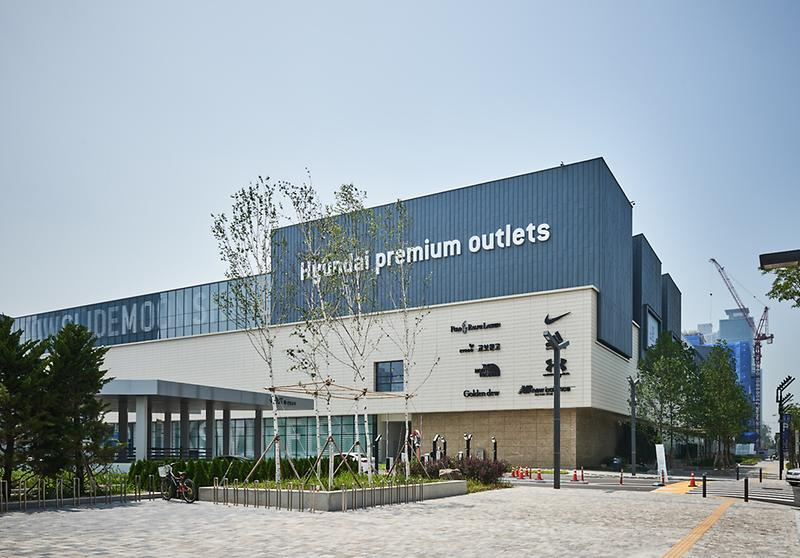
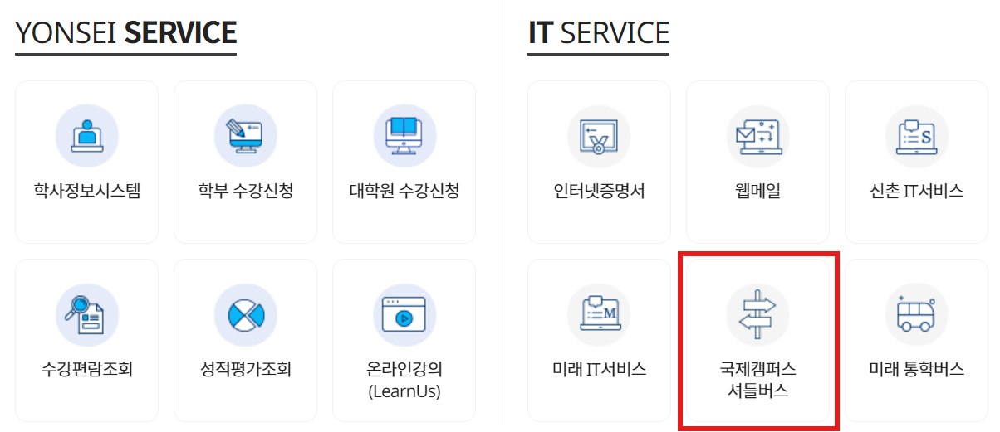

# index

## 1. How to issue each certificate and document
## 2. Guideline for university application using
## 3. Introductions of facilities in Songdo campus and dormitary
## 4. Destinations near International campus 
## 5. Public Transportation in International Campus and Shuttle Bus Reservation Method 
## 6. Introductions of Instagram accounts of different student councils in GLC

## How to issue each certificate and document

### How to obtain an Alien Registration Card (ARC)
#### Required Documents:
1.	Certificate of Enrollment: 
Can be issued through Web Online Transcripts & Certificates Issuance feature on Yonsei Portal

2.	Certificate of Residence:
Yonsei Portal Log in -> Academic Information System -> Dormitory-> Certificate of Residence (Choose Eng/Kor)

3.	Passport: Print and submit

4.	Visa

5.	Color ID Photo 3.5cm×4.5cm

6.	Application form (not required if applying for Alien Registration Card as a group)

**How to apply:**
For group applications
-Prepare the required documents, pay the fee, and apply.
-An announcement to apply as a group will be posted on the school’s notice board
For individual application
-Make an appointment at High Korea and bring your documents with you.
-You must make an appointment with High Korea immediately after entering the country because available spots will run out soon
-You will need to go to the Immigration Office in Incheon.

### How to open a bank account 
- After visiting the bank, draw a queue and wait until your number is called.
- Follow the staff's instructions to fill out an application form and submit documents to open a bank account.
- Follow the instructions to enter your password and collect your bank account passbook and card.
**Documents required to open a bank account**
- Certificate of Enrollment (a proof that you are studying at a school)
- Certificate of Residence
- Passport and Alien Registration Card (ARC)

### How to open a Korean mobile phone number (SIM Card)
Procedure:
- Submit a copy of your Alien Registration Card (ARC) or passport to the carrier's branch or agent, and if you are applying on behalf of a representative, you must also present the representative's ID.
- Get a cell phone number from your carrier's agent or online.
- Consider the different types of mobile phone using plans and choose one that suits your needs.
Documents required for activation
- ID (passport, alien registration card, etc.)
- Korean bank account

## 2. Guideline for university application using
### Yammi

Student restaurant paying application: **online payment method needed**
The Yammi app is available on both campuses and allows you to pay online for food in the student restaurant. You can also order the thousand won Breakfast, which is an ongoing program at the university in Korea, after your student ID is verified on Yammi. You can also view photos, reviews, and comments about the food. In addition, you can also order online from the school cafe with the Yammi app. You must have a debit card to pay, so a bank card or online payment method is required. 
#### Guideline for using Yammi application (dorm restaurant, student restaurant, beverage etc.) : 
Download the Yammi app→ Choose your school (Yonsei University(International))→click the starting button→ login/ registration (phone number needed)
→choose the restaurant(dorm 1 , dorm2 , Y plaza restaurant(나눌샘)), café
→ Select a menu and click the Add button to Cart
→ Add the payment information→ Pay 
→ Get food with QR codes. 
- The **cash payment is unavailable** on the Yummy app, if you don't have an account or want to pay with cash, you can pay at the cashier at each restaurant/coffee shop.

### Everytime 

College student online community: portal account(student number) needed
Log in by using the Yonsei portal account, and check various post boards. You can get different information by scrolling.
Another core function is course check.
You can add the course that you want to take to your schedule, and the visualization of the week schedule will automatically generated. After the semester is finished, input the course grade, and it will be converted into 4.3 standard. After the request is approved by the friend, you can also see your friend's timetable. If you click on a specific class, you can also view evaluations for the class. The reviews are all written by students who have taken the class in the past semesters.

### mY-seat2

Library app: portal account(student number) needed
_‘mY-seat2’ mainly consists of two functions: reserving library seats and reserving access to library facilities. After logging in by using the Yonsei portal account, choose the library, and check all the available seats! After you are assigned to your preferred seat, you will be given a four-hour pass to the seat. When you reserve a library facility, you may be asked to enter your student ID number, and the last four digits of your phone number. And you may also need to input others’ information  depending on the minimum number of people to use the facility.

### Y-Attend：

Yonsei University's online attendance system
At school, there is always an attendance check before the classes. Some classes use electronic attendance to check attendance. The professor in the class will give the student a 4-character numeric code, and the student needs to enter the app, log in, and automatically see a "Please enter the number" screen. If it is successfully entered within time, the attendance will be checked.

## 3. Introductions of facilities in Songdo campus and dormitary
### Underwood Memorial Library
It is commonly abbreviated as "언기도". There are two entrances. On the front, it is connected to the Y-Plaza on B1 floor by going down the stairs, and on the other side, it is connected to the outside and behind the first floor.
•B1 - Community Lounge: In 'Creative Talks', TED lectures are played on screen. In 'Art Gallery', colorful photos are displayed on many screens.
### Y-Plaza 
Commercial facilities connected to the 1st basement floor of Underwood Memorial Library. There are various facilities such as Haneul-saem (shopping store), Gaon-saem (stationary, bookstore), Naneul-saem (restaurant), Areumdaun-saem (hair salon), and Bonjeongsaem (print store) and various facilities such as optician and cafe.
•1st floor - Information Commons: You can receive reservation books, campus loan books, mutual loans, and accompanying materials at the user integrated service desk.
•2nd floor - Multimedia Center: Media viewing room. There is a reading room and you can read 
•4th floor – Library classroom: Lectures, new books, and RC recommendation books are provided. There are nine egg-shaped four-colored sofa named 'Fanse'. When you sit on the four-story Fanse, you can read various magazines and see the sea.
•5th floor - Materials reading room: Books with claim number 000-699 are located.
•6th floor - Materials reading room: Books with claim number 700 to 999 are located.
•7th floor - International conference hall: Seminar room, unmanned lounge and terrace lounge.

### Dormitory facilities 
#### Delivery room, unmanned delivery box, smile box 
1st floor of building A and building D

#### Mailbox
It is located in each building. Only building F, building G, building D, is located on the first floor.

#### Reading room
1st floor of Dorm 1, building A
2nd floor of Dorm2, D Building,(above the lounge on the 1st floor) 

#### Seminar room
Dorm 1 A and B Building 7 (crossing bridge), C Building 1st floor, and 5th floor
2nd Class D Building 3rd Floor 
How to book a seminar room: 
After logging in to Yonsei Port → Academic Information System → dormitory> Seminar room reservation → Living Hall (select from Songdo 1st and 2nd) → Select reservation date, seminar room, and reservation time among available reservation time → Enter event information → Apply 

#### Laundry room
B1F of  building A, building C, Dorm 1
Female(5th floor of building G) and male(5th floor of building F), Dorm 2
How to do laundry:
1. Buying a laundry card
You can use it after charging your card 
2. Download the 'Meta Club' app
Payments, etc. are all done with this app.
*Foreign registration card, mobile phone authentication required 

#### Convenience store (living cooperative) 
B1F of Dorm 1
1st floor of Dorm 2, building d

#### Dormitory restaurant 
1st floor of each dorm building

#### Cafe 
B1F of the Dorm 1
1F of the Dorm2, building D (Inside Dormitory Restaurant)
a communal kitchen 
B1F of Dorm 1(next to the dormitory restaurant)
5th floor of Dorm 2,  building F (you have to get off the elevator on the 4th floor and go up the emergency stairs) 

#### Computer room/multimedia room (printing machine, black and white printable) 
1st floor of Dorm 1 building A 
3rd Floor of Dorm 2 building D 

#### table tennis/ball court/recreation room 
Community room (joint refrigerator, garbage collection, microwave) 
B1F of the Dorm1 
1st floor between G and D, dorm 2

#### Woori Bank
1st floor of Dorm 1, building B 

## 4. Destinations near International campus 

### 1.	Triple Street

- Address: 33-3 Songdogwahak-ro 16beon-gil, Yeonsu-gu, Incheon (650m away from Technopark Station Entry 2)
- Opening hours: 10:30~22:00
- Restaurants, pubs, cafes, cinemas, bowling alleys, arcades, fashion stores, Daiso,...
- 15 mins walking distance from Songdo Dorm 1

### 2.	Hyundai Premium Outlet Songdo

- Address: 123 Songdogukje-daero, Yeonsu-gu, Incheon ( 64m away from Technopark Station Entry 2)
- Opening hours: 10:30~21:00
- Next to Triple Street
- Food court, Kyobo book centre, fashion stores, sport brands,...

### 3.	Songdo Central Park

- Address: 160 Convensia-daero, Yeonsu-gu, Incheon (708m away from Central Park Station Entry 3)
- Songdo Central Park is famous for having one of the best lakes for enjoying night views.
- Boats for rental

### 4.	Caisson 24 Bakery & Cafe
- Address: 20 Convensia-daero 391beon-gil, Yeonsu-gu, Incheon
- Opening hours: 9:00~22:00
- A great place to enjoy the ocean view and sunset.

### 5.	Campus Town Station commercial zone
- Address: 50m away from Campus Town Station Entry 2
- Restaurants, cafes, pubs, beauty salons,...

## 5. Public Transportation in International Campus and Shuttle Bus Reservation Method 

### 1.	Riding the Shuttle Bus

Reservation Method: Yonsei Portal (http://portal.yonsei.ac.kr) –> Int’l Campus Shuttle Bus –> Reservation

Present the “bus reservation receipt” or “reservation text message” received after reserving along with your ID card when boarding the shuttle bus. 

Seat reservations are opened at 2:00 p.m. two days prior to the designated date. 

Shuttle Bus Boarding Location 
International campus 

Location: Bus stop located across Songdo dorm 1 B building 

Sinchon Campus

Location: The commons underground parking lot (next to starbucks) 
How to find: use the escalator infront of the Student Union building to go down to the basement floor then turn left and go straight to find a door to the parking lot, pass that door and walk to the right end to find the bus stop. 

### 2.  Main Public Transportation around International Campus 

#### Buses: 

1.	Yonsei University 
Location: behind Songdo dorm 1 C building 

Routes :
-	M6724 –> Songdo International Campus <-> Seoul Station (Passing Sinchon station) 
-	9201 –> Sangho Apartment <-> Gangnam Station ( Fastest way to Gangnam) 
-	303-1 –> Incheon International Airport <-> Sipjeonbuilding g Garage (cannot bring luggage on the bus) 
-	1302 –> Korea Polar Research Institute <-> Seoul station (takes more time) 

2.	Campus Town Station 
Routes : 6777-1 Incheon International Airport <-> Incheon Bus Terminal ( can bring luggage on the bus)

These are the common bus routes that students in the International Campus use. There are other bus routes available that you can search on your own.  

#### Subway: 

Campus Town Station 

Routes: Incheon Line 1 Songdo Moonlight Festival Park Station <-> Gyeyang Station

Transfer stations : 

-	Woninjae Station : Suin Bundang line 
-	Bupyeong Station : Line 1 
-	Bupyeong-gu Office Station : Line 7 
-	Gyeyang Station : Airport Line 

## 6. Introductions of Instagram accounts of different student councils in GLC
   
   1. GLC student council : glc_pixel
   2. International Commerce major student council: yonsei_ic
   3. Cultural Media student council: panorama_yonsei
   4. Applied Information Engineering major student council: yonsei_aie
   5. GLC foreign student council: yonseiglc_revo

