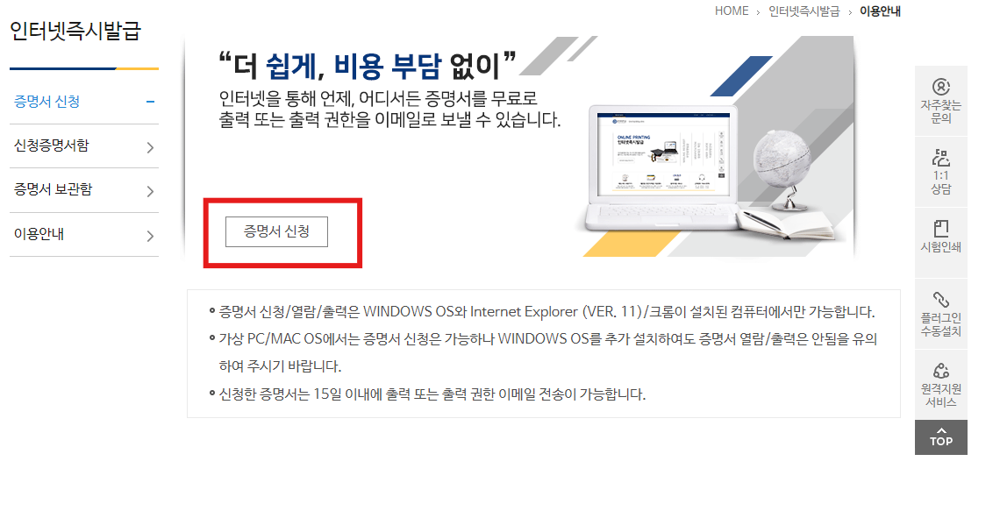
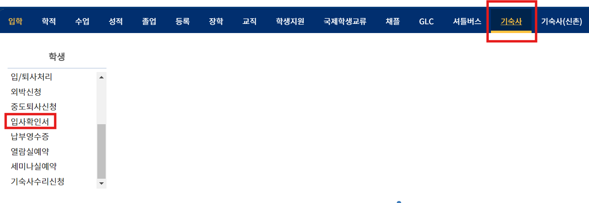
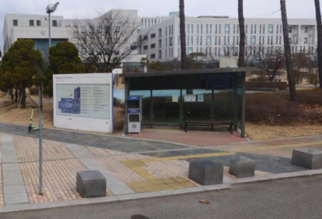

목차
## 1. 각 증명 및 서류 발급 방법
## 2. 각 관련된 앱 이용 
## 3. 국제 캠퍼스 및 기숙사 시설
## 4. 국제 캠퍼스 주변 시설 소개
## 5. 국제캠퍼스 대중교통 및 셔틀 예약 방법
## 6. GLC 각 학생회 인스타 소개

## 1. 각 증명 및 서류 발급 방법

### 외국인등록증 발급 방법
**준비 서류**
1.	재학증명서
연세포탈 Web증명서 발급에서 발급할 수 있음

2.	거주증명서
연세포탈 학사 정보시스템에서 기숙사-> 입사확인서에서 국문으로 발급

3.	여권(인쇄 후 제출)

4.	비자

5.	컬러 증명사진 3.5cm×4.5cm

6.	신청서(외국인등록증을 단체로 신청할 경우에는 필요 없음)

**신청 방법**
단체 신청의 경우
-	필요 서류를 준비하여 수수료를 납부 후, 신청
-	학교에서 공지가 올라옴
개인 신청의 경우
-	하이코리아에서 방문 예약을 한 후, 서류를 가져가야 함.
-	예약은 바로 마감될 수 있으니 입국 후 바로 잡아야 함.
-	인천 외국인 출입국사무소에 가야 함.

### 은행 계좌 개설 및 휴대폰 개통 방법
- 은행에 방문한 뒤에 순번 대기표를 뽑아서 자기 번호가 나올 때까지 대기한다.
- 통장 개설을 위해 직원의 안내에 따라 신청서를 작성하며 서류를 제출한다.
- 직원의 안내에 따라 비밀번호를 입력하고 발급된 통장과 카드 등을 챙긴다.

**은행 계좌 개설 시 제출해야 하는 문서:**
- 재학증명서
- 거주증명서
- 여권 및 외국인 등록증

### 휴대폰 개통 방법
절차:
- 통신사의 지점 또는 대리점에 외국인 등록증 사본 또는 여권 사본을 제출하며, 대리인이 신청하는 경우에는 이 외에도 대리인 신분증을 제시해야 한다.
- 통신사 대리점이나 온라인으로 휴대폰 번호를 발급 받는다.
- 다양한 휴대폰 요금제 유형을 고려하여 자신의 필요에 맞는 요금제를 선택한다. 

**개통 시 필요 문서:**
- 신분증 (여권, 외국인등록증 등)
- 한국 은행 계좌

## 2. 각 관련된 앱 이용

### Yammi 야미

**학생 식당 결제 앱:은행카드 등 온라인 결제 수단 필수**
야미 앱은 두 개 캠퍼스에서 모두 적용할 수 있고, 학생 식당에서 음식을 **온라인 결제**를 하는 앱이다. 한국에 있는 해당 대학교에서 계속 진행하고 있는 ‘천원의 아침밥’도 야미에서 학생인증을 승인된 후에 주문할 수 있습니다. 이 외에도 해당 음식의 사진, 리뷰, 댓글 등 모두 조회할 수 있습니다. 추가로, 야미 앱으로 학교 카페에서 온라인 주문도 가능합니다. 결제 기능은 체크카드가 있어야 가능함을 따라, 은행카드, 혹은 **온라인 결제 수단은 필수**입니다.

#### 야미 앱 사용 방법 (기숙사 식당, 학식, 음료 구매) : 
야미 앱을 다운로드
→학교를 선택 (연세대학교(국제))
→야미 시작하기 버튼 누름
→로그인하기/ 회원 가입하기 (전화번호 필수)
→식당 선택하기 (1기숙사, 2기숙사, Y플라자 나눌샘, 카페 (트레비앙, 커피앤))
→메뉴 선택 후에 장바구니 담기 버튼을 누름 
→결제할 카드 등록→결제 
→ QR코드로 음식 받기. 
- 야미 **앱에서는 현금 결제 불가능**, 계좌가 없거나 현금으로 내고 주문하려면 각 식당/ 커피숍에 있는 계산대에서 결제 가능

### Everytime 에브리타임

대학생 자기의 커뮤니티: **학사계정(학번) 필수**
연세포탈(Yonsei portal)의 계정을 통해 등록하고 안에서 각종 게시판이 표시되어 있다. 이 중에 여러 가지 정보를 조회할 수 있음.
하나 더 핵심 기능은 수업 조회이다.

자기가 선호한 수업을 시간표내에 추가하고, 수업 시간표를 자동적으로 시각화한다. 학기 끝난 후에 자기가 해당 수업 성적을 입력하고, 4.3기준의 성적을 자동으로 환산된다. 요청 승인 후에 친구의 시간표도 볼 수 있다.

구체적인 수업을 클릭하면, 수업에 대한 평가도 조회할 수 있다. 평가는 모두 예전에 이 수업을 수강한 학생들이 작성했다.

## mY-seat2

도서관 이용 앱-학사 계정(학번) 필수
‘mY-seat2’는 주로 도서관 좌석 예약 및 도서관 시설 이용 예약 두 기능으로 이루어져 있다. 학사 계정으로 로그인 후에 이용 도서관을 선택하면 이용 가능한 좌석을 나온다. 선호하는 좌석으로 배정한 후에 4사간의 좌석 이용권을 부여한다. 도서관 시설 예약할 경우, 시설 이용 최소 인원수에 따라 사용자의 학번, 전화번호 뒤 4자리를 입력할 경우도 있다.

### Y-Attend：

연세대학교 전자출결 시스템
학교에서 수업을 진행하기 전에 항상 수업 출석 확인이 있다. 이때 전자 출결로 인증하는 수업도 있다. 해당 수업에 계신 교수님이 학생에게 4 자시 숫자를 알려주면서 학생이 이 앱을 들어가서 로그인 후에 자동으로 “숫자를 입력해 주세요”라는 화면을 나타낸다. 해당 시간 내에 성공하게 입력되면 수업 인증이 완료한다

## 3. 국제 캠퍼스 및 기숙사 시설
### 언더우드기념도서관 
보통 '언기도'라는 약칭으로 불린다. 폐관 시간은 자정이고 출입구는 2개가 있는데, 정면에서는 계단을 내려가서 지하 1층 Y-플라자와 연결되고, 후면의 나머지 하나는 1층 바깥 뒤편으로 연결된다.
- 지하 1층 - 커뮤니티 라운지 : 'Creative Talks'라는 곳에선 TED 강의가 스크린에 재생되어 있다. '아트갤러리'에서는 여러 스크린에 다채로운 색상의 사진들이 전시되어 있다.

### Y-Plaza 
 언기도 지하 1층과 연결되는 상가 시설. 생활협동조합 상점으로는 하늘샘[매점], 가온샘[문구점·서점], 나눌샘[식당], 아름다운샘[미용실], 본뜰샘[인쇄점]이 있고, 안경원, 카페 등 다양한 시설이 있다.
- 1층 - 인포메이션 커먼스 : 이용자통합서비스데스크에서 예약도서, 캠퍼스대출도서, 상호대차, 딸림자료 등을 받을 수 있다.
- 2층 - 멀티미디어 센터 : 미디어 감상실. 열람석이 있어 영화나 드라마, 다큐멘터리 등의 DVD를 열람할 수 있다. 영화 수도 많다. 1인실, 2인실 모두 있으며 3인 이상은 아예 9인실, 6인실 크기의 시네마 방을 빌려 스크린으로 DVD를 볼 수 있다.
- 3층 - 협업 파크 : 그룹 스터디룸, PC 익스프레스 구역이 자리 잡고 있다. 
- 4층 - 창의 열람실 : 강의, 신간, RC추천도서가 비치되어 있다. '팡세'라는 이름의 계란 모양의 사색소파가 9개 있다. 팡세에 앉으면 4층에 비치된 여러 가지 잡지도 읽고, 바다도 보인다.
- 5층 - 자료 열람실 : 청구기호 000-699번 도서들이 자리 잡고 있다.
- 6층 - 자료 열람실 : 청구기호 700-999번 도서들이 자리 잡고 있다.
- 7층 - 국제회의실 : 세미나실, 무인 휴게실, 테라스 라운지가 있다.

### 기숙사 시설 
택배 보관실, 무인택배함, 스마일박스 
1학사 A동 1층
2학사 D동 1층 
우편함
각 동에 있음. F동 G동만 D동 1층 안에 있음. 

#### 열람실
1학사 A동 1층
2학사 D동 2층 (1층 휴게실 위에 있음.) 

#### 세미나실
1학사 A와 B동 7층 (넘어가는 다리), C동 1층, 5층
2학사 D동 3층 
세미나실 예약 방법: 
연세포탈 로그인 후→학사정보시스템→기숙사>세미나실예약→생활관 (송도 1학사, 2학사 중 선택)→예약일자 선택,세미나실 선택, 예약가능시간 중 예약 시간 선택→행사정보 입력→신청 

#### 세탁실
1학사 A동 C동 B1층 
2학사  G동  5층 여성, F동 5층 남성 

#### 빨래 방법
1학사
세탁 카드 구입
카드 충전을 하고 이용 가능 
2학사
‘메타클럽’ 앱을 다운로드
결제등 다 이 앱으로 한다.
**외국인 등록증, 휴대폰 인증 필수**

#### 편의점 (생협) 
1학사 B1층
2학사 D동 1층 

#### 기숙사 식당 
1학사 자하 1층 
2학사 D동 1층 

#### 카페 
1학사 지하 1층 
2학사 D동 1층 ( 기숙사 식당 안) 

#### 공동 주방 
1학사 지하 1층 (기숙사 식당 옆에)
2학사 F동 5층 (엘리베이터 4층에서 내리고 비상계단으로 올라가야함) 

#### 컴퓨터실/멀티미디어룸 (인쇄기, 흑백 인쇄 가능) 
1학사 A동 1층 
2학사 D동 3층 

#### 탁구/당구장, 레크리에이션 방 
커뮤니티룸 (공동 냉장고, 쓰레기 불리수거, 전자레인지) 
1학사 지하1층 
2학사 G와 D동 사이 1층 

우리은행
B동 1층

#### 헬스장
 주소: 국제캠퍼스 종합관 1층
 
#### 심리상담센터
주소: 송도2학사 G동 반피득홀
방문전 온라인 예약 필수 (https://counsel.yonsei.ac.kr/ysclinic/index.do#a)

#### 의무실
주소: 국제캠퍼스 종합관 1층
간단한 치료를 받을 수 있고 약을 무료로 받을 수 있다
주말 운영하지 않음

## 4. 국제 캠퍼스 주변 시설 소개
 
### 1.트리플스트리트

- 주소: 인천 연수구 송도과학로16번길 33-1 (테크노파크역 2번 출구에서 650m)
- 영업시간: 매일 10:30~22:00
- 식당, 술집, 카페, 영화관, 볼링장, 오락실, 옷 가게 다이소등
- 송도 1학사에서 도보 15분 도착

### 2.현대프리미엄아울렛 송도점    

- 주소: 인천 연수구 송도국제대로 123 현대프리미엄아울렛 송도점 (테크노파크역 2번 출구에서 64m)
- 영업시간: 매일 10:30~21:00
- 트리플스트리트 옆에 현대프리미엄아울렛이 있음
- 푸드코트, 교보문고 서점, 영패션 및 스포츠 브랜드 등등

### 3. 송도 센트럴파크

- 주소: 인천 연수구 컨벤시아대로 160 (센트럴파크역 3번 출구에서 708m)
- 인천 야경 명소인 호수가 있는 공원
- 유료 보트 이용 가능

### 4.케이슨24 베이커리 카페
- 주소: 인천 연수구 컨벤시아대로391번길 20 케이슨24
- 영업시간: 매일 9:00~22:00 
- 아름다운 오션뷰와 노을 명소 카페 그리고 산책로

### ５.　캠퍼스타운역 상권
- 주소: 캠퍼스타운역 2번 출구 50m
- 주로 식당으로 
- 마라탕, 카페, 술집, 한식집, 미용실 등 있다

## 5. 국제캠퍼스 대중교통 및 셔틀 예약 방법
   
### 1. 셔틀버스 탑승

방법 : 연세포탈서비스(http://portal.yonsei.ac.kr) -> IT서비스 -> 국제캠퍼스 셔틀버스 예약
탑승 시 “버스 예약접수증” 또는 예약 시 받은 “휴대폰 예약 문자메시지”를 신분증과 함께 제시하여 주시기 바랍니다.
좌석 예약은 지정일 이틀 전 오후 2:00부터 제공됩니다.

셔틀버스 탑승 위치 안내
국제캠퍼스

위치: 송도1학사 B동 맞은편에 있는 버스 정류장 

신촌캠퍼스

위치: 백양누리 지하 주차장 ( 스타벅스 연세백양로점 옆에)
찾는 방법: 학생회관 앞에 있는 에스 컬레이터를 이용해서 지하로 내리고 좌회전 후 직진하여 주차장 문을 열고 오른쪽으로 끝에 가면 된다.
### 2. 국제캠퍼스 주변  주로 대중교통
   
#### 버스편
1. 연세대학교
위치: 1학사 C동 뒤에 있음
노선:  
M6724  송도 국제캠퍼스 <-> 서울역 ( 신촌역 경유 )
9201   성호아파트 <-> 강남역 ( 강남에 갈 수 있는 가장 빠른 방식 )
303-1  인천국제공항 <-> 십정동차고지 ( 케리어 들고 못 탄다 )
1302   극지연구소 <-> 서울역 ( 운행시간 길다 )
  
2. 캠퍼스타운역
노선: 6777-1  인천국제공항 <-> 인천버스터미널 ( 케리어 들고 탈 수 있음)

!!!! 이상은 국제캠퍼스에 있는 학생들이 자주 이용하는 버스 노선입니다. 다른 버스 노선도 있는데 여러분 스스로 탐색하세요~
             
#### 지하철편
캠퍼스타운역
노선: 인천 1호선 송도달빛축제공원역 <-> 계양역

환승역: 원인재역: 수인분당선
인천시청역: 인천 2호선
부평역: 1호선
부평구청역: 7호선
계양역: 공항선 

## 6. GLC 각 학생회 인스타 소개
   
1. GLC 학생회: glc_pixel
2. 국제통상전공 학생회: yonsei_ic
3. 문화미디어전공 학생회: panorama_yonsei
4. 응용정보공학전공 학생회: yonsei_aie
5. 외국인학생회: yonseiglc_revo
